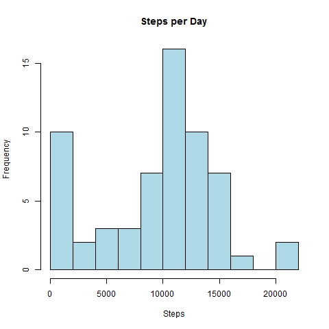
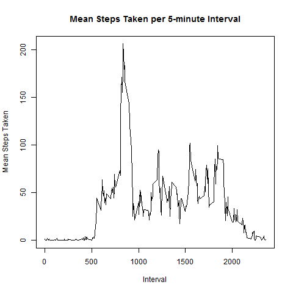
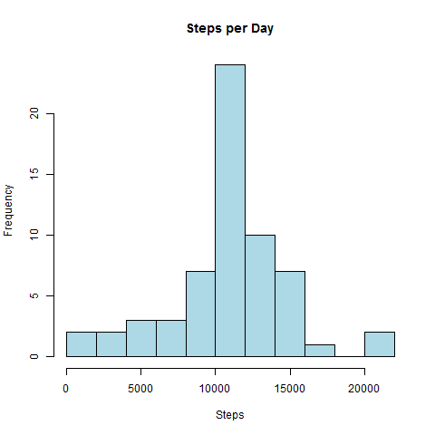
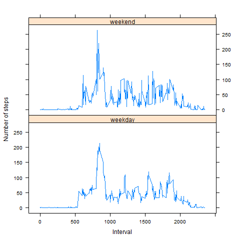

## Loading and preprocessing the data

1. Load the data (i.e. `read.csv()`)


```r
data <- read.csv("activity.csv")
```

2. Process/transform the data (if necessary) into a format suitable for your analysis


```r
data$date <- as.Date(data$date)
```

## What is mean total number of steps taken per day?

1. Make a histogram of the total number of steps taken each day


```r
#calculate steps per day
dailySteps <- aggregate(data$steps,by=list(data$date),FUN=sum,na.rm=TRUE)
names(dailySteps) <- c("date","steps")

#plot and save the histogram of steps per day
#breaks are in blocks of 2000 steps
png("dailysteps.png")
hist(dailySteps$steps,main="Steps per Day",xlab="Steps",breaks=8,col="lightblue")
dev.off()
```

```
## RStudioGD 
##         2
```



2. Calculate and report the **mean** and **median** total number of steps taken per day


```r
meanSteps <- mean(dailySteps$steps)
medSteps <- median(dailySteps$steps)
```
The *mean* number of steps per day is **9354.23**
The *median* number of steps per day is **10395**

## What is the average daily activity pattern?

1. Make a time series plot (i.e. `type = "l"`) of the 5-minute interval (x-axis) and the average number of steps taken, averaged across all days (y-axis)


```r
mean_interv_steps <- aggregate(data$steps,by=list(data$interval),FUN=mean,na.rm=TRUE)
names(mean_interv_steps) <- c("interval","meanSteps")

png("mean_interv_steps.png")
plot(mean_interv_steps$interval,mean_interv_steps$meanSteps,type="l",main="Mean Steps Taken per 5-minute Interval",xlab="Interval",ylab="Mean Steps Taken")
dev.off()
```

```
## RStudioGD 
##         2
```



2. Which 5-minute interval, on average across all the days in the dataset, contains the maximum number of steps?


```r
maxInterval <- mean_interv_steps$interval[which.max(mean_interv_steps$meanSteps)]
```

The 5-minute interval which contains the maximum number of steps, on average across all days in the dataset, is interval **835**


## Imputing missing values

1. Calculate and report the total number of missing values in the dataset (i.e. the total number of rows with `NA`s)


```r
numMissingSteps <- nrow(data[is.na(data$steps),])
```

There are **2304** rows with missing values in the dataset

2. Devise a strategy for filling in all of the missing values in the dataset. The strategy does not need to be sophisticated. For example, you could use the mean/median for that day, or the mean for that 5-minute interval, etc.

The average for the day would show an abnormally uniform distribution of steps. In addition, the missing values appear to be entire days with no data.

I will use the average number of steps, across all days, for each interval to replace the missing values.

3. Create a new dataset that is equal to the original dataset but with the missing data filled in.


```r
dataImputed <- merge(x=data,y=mean_interv_steps,by="interval",all.x=TRUE)
dataImputed$steps[is.na(dataImputed$steps)] <- dataImputed$meanSteps[is.na(dataImputed$steps)]
```

4. Make a histogram of the total number of steps taken each day and Calculate and report the **mean** and **median** total number of steps taken per day. Do these values differ from the estimates from the first part of the assignment? What is the impact of imputing missing data on the estimates of the total daily number of steps?


```r
#calculate the total number of steps per day
dailyStepsImputed <- aggregate(dataImputed$steps,by=list(dataImputed$date),FUN=sum,na.rm=TRUE)
names(dailyStepsImputed) <- c("date","steps")

#plot and save the histogram of steps per day
#breaks are in blocks of 2000 steps
png("dailystepsImputed.png")
hist(dailyStepsImputed$steps,main="Steps per Day",xlab="Steps",breaks=8,col="lightblue")
dev.off()
```

```
## RStudioGD 
##         2
```




```r
meanStepsImputed <- mean(dailyStepsImputed$steps)
medStepsImputed <- median(dailyStepsImputed$steps)
```

The *mean* number of steps per day, after imputing missing values, is **10766.19**
The *median* number of steps per day, after imputing missing values, is **10766.19**

Both the mean and median are higher than they were in the original dataset, although the mean is much more so. Interestingly, the mean and median appear to be the same and the median is no longer an integer. This is likely because all intervals with missing data were replaced with the average from other intervals. Since entire days were missing step data, this resulted in the all days with missing data now containing the average number of steps, shifting the distributiong.
 
## Are there differences in activity patterns between weekdays and weekends?

1. Create a new factor variable in the dataset with two levels -- "weekday" and "weekend" indicating whether a given date is a weekday or weekend day.


```r
dataImputed$weekday <- as.factor(ifelse(weekdays(dailyStepsImputed$date) %in% c("Saturday","Sunday"), "weekend", "weekday"))
```

2. Make a panel plot containing a time series plot (i.e. `type = "l"`) of the 5-minute interval (x-axis) and the average number of steps taken, averaged across all weekday days or weekend days (y-axis). The plot should look something like the following, which was created using **simulated data**:


```r
mean_interv_wd_steps <- aggregate(dataImputed$steps,by=list(dataImputed$interval,dataImputed$weekday),FUN=mean,na.rm=TRUE)
names(mean_interv_wd_steps) <- c("interval","weekday","meanSteps")

library(lattice)
png("mean_interv_wd_steps.png")
xyplot(meanSteps~interval | weekday, data = mean_interv_wd_steps, type = 'l', xlab = 'Interval', ylab = 'Number of steps', layout = c(1,2))
dev.off()
```

```
## RStudioGD 
##         2
```


